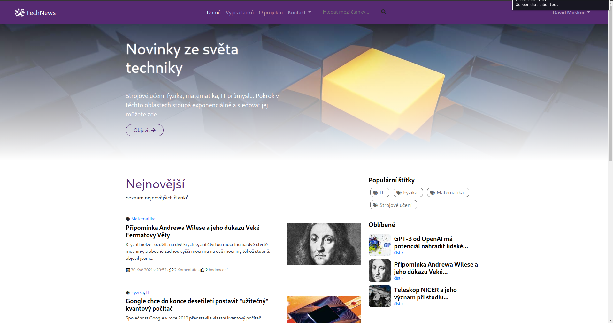
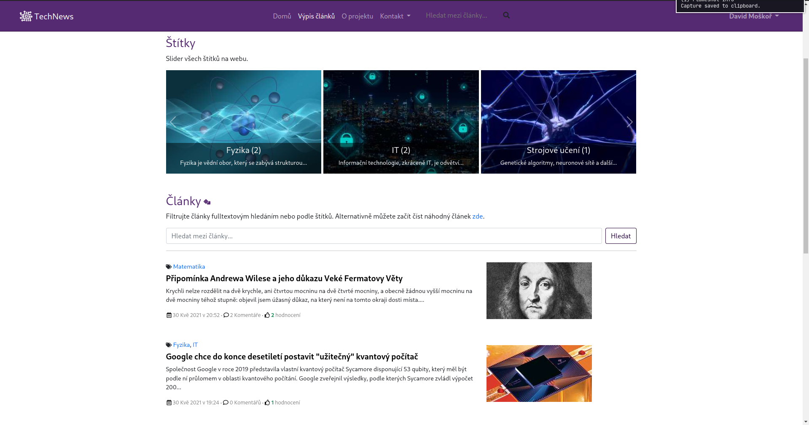
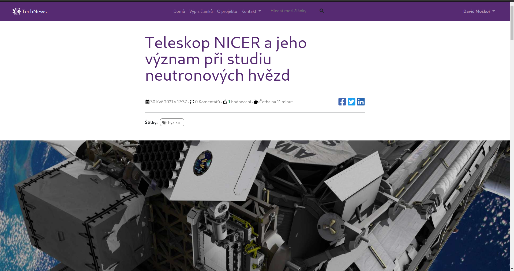
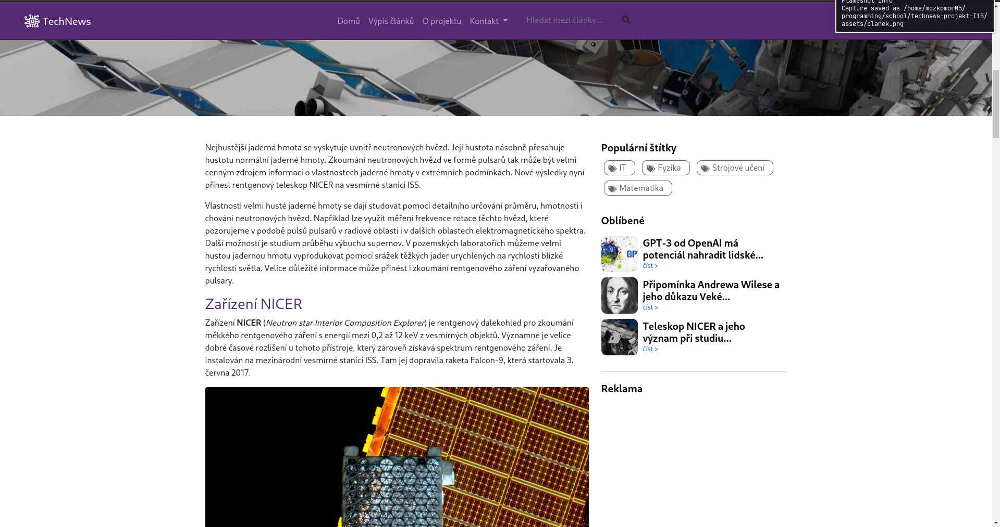
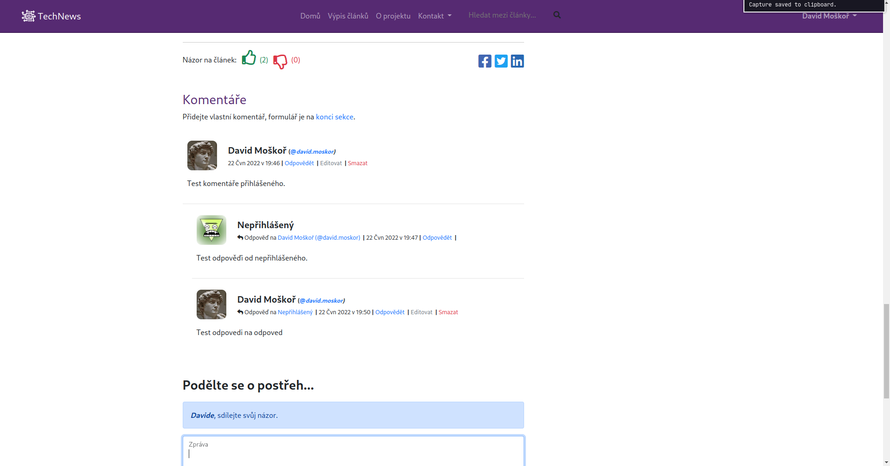
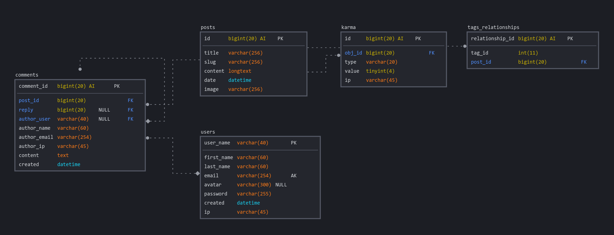

# TechNews - I2B ZWA Projekt

Závěrečný projekt druhého ročníku I2B předmětu Základz webových aplikací.

## Ukázka projektu

Projekt je nasazen na free hostingu [endora.cz](https://endora.cz/) na
doméně **[https://tech-news.tode.cz/](https://tech-news.tode.cz/)**.

### Screenhosty

## Funkce

- Vypsání článků
- Hledání mezi články
- Fotogalerie
- Přihlášení a registrace
- Nastavení účtu
- Nahrávání a ořežování profilového obrázku
- Komentáře pro přihlášené i nepřihlášené uživatele
- Ochrana proti robotům (CAPTCHA)
- Responsivní design

## Technická dokumentace

### Struktura databáze

Vyexportovanou databázi najdete v souboru [struture_export.sql](/dev/strucutre_export.sql).

### Struktura kódu

Přes Apache rewrite (viz [.htaccess](/src/.htaccess)) je vše přesměrováno na [index.php](/src/index.php).
Ten poté načte korespondující šablonu a zobrazí její obsah.

Kód je členěn do pomocných tříd pro práci s uživateli a příspěvky. Samotná aplikace se skládá s několika komponent,
které jsou všechny načteny v singletonu `App`, čímž se vyhýbám nutnosti použít globální proměnné.

### Použité technologie

Při tvorbě projektu jsem použil následující technologie:

- [PHP](https://www.php.net/)
- [MySQL](https://www.mysql.com/)
- [HTML5](https://www.w3.org/TR/html5/)
- [CSS3](https://www.w3.org/Style/CSS/)
- [JavaScript](https://www.javascript.com/)
- [jQuery](https://jquery.com/)
- [Bootstrap](https://getbootstrap.com/)
- [Font Awesome](https://fontawesome.com/)
- [Composer](https://getcomposer.com/)
- [MeekroDB](https://meekro.com/)
- [Python](https://www.python.org/)
- [Git](https://git-scm.com/)